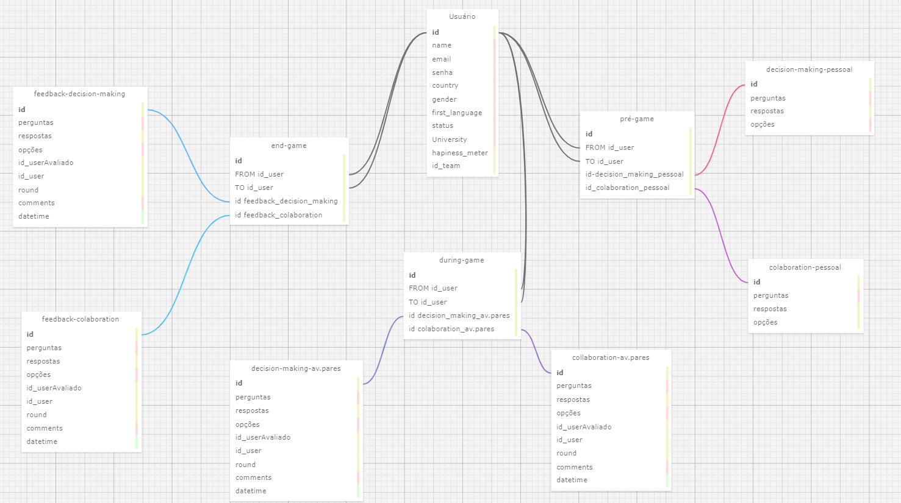

# Ponderada_3_Thiago-Volcati

## Documentação Detalhada do Modelo Relacional

**Projeto:** Sistema de Feedbacks do Cesim Game
**Data:** 2024-05-12  
**Autor:** Thiago Volcati
**Objetivo:** Este documento visa fornecer uma descrição detalhada do modelo relacional utilizado no projeto de jogo interativo. O foco está em mapear as interações e feedbacks dos usuários durante as diversas fases do jogo, destacando a estrutura de dados e os relacionamentos essenciais.

### Entidades

#### **Usuário** (`Usuário`)
- **Descrição:** Armazena todas as informações pessoais e acadêmicas dos usuários participantes.
- **Atributos Principais:**
  - `id`: Identificador único do usuário (chave primária).
  - `name`: Nome completo do usuário.
  - `email`: Endereço de e-mail.
  - `senha`: Senha de acesso ao sistema.
  - `country`: País de origem.
  - `gender`: Gênero.
  - `first_language`: Primeira língua falada.
  - `status`: Status atual no sistema (ativo, inativo, ocupado, etc).
  - `University`: Instituição de ensino que frequenta.
  - `hapiness_meter`: Medidor de satisfação ou felicidade.
  - `id_team`: Identificador do time ao qual o usuário pertence.

#### **Etapas do Cesim Game**
- **Pré-Jogo** (`pré-game`)
  - **Descrição:** Registra as avaliações e escolhas feitas pelos usuários antes do início efetivo do jogo.
  - **Relacionamentos:** Recebe as avaliações iniciais de seus pontos de vista sobre seus perfis profissionais.
- **Durante o Jogo** (`during-game`)
  - **Descrição:** Captura decisões e interações entre os usuários enquanto o jogo está ativo.
  - **Relacionamentos:** Mantém registro das interações avaliativas entre os usuários, com referências cruzadas aos participantes.
- **Pós-Jogo** (`end-game`)
  - **Descrição:** Armazena os feedbacks fornecidos após a conclusão das sessões de jogo.
  - **Relacionamentos:** Conecta os feedbacks dados a quem os recebeu e a quem os enviou.

#### **Feedback**
- **Decison Making** (`feedback-decision-making`)
  - **Descrição:** Coleta feedback sobre as decisões tomadas pelos usuários durante o jogo.
  - **Relacionamentos:** Associa cada feedback ao usuário avaliado e ao avaliador.
- **Colaboração** (`feedback-colaboration`)
  - **Descrição:** Registra impressões sobre como os usuários trabalharam em conjunto durante o jogo.
  - **Relacionamentos:** Similar ao feedback de decisão, conecta o feedback à sessão colaborativa relevante.

#### **Avaliação de Pares**
- **Decisão** (`decision-making-av.pares`)
  - **Descrição:** Avaliações específicas sobre decisões tomadas pelos usuários em um contexto de pares.
  - **Relacionamentos:** Vincula a avaliação ao usuário avaliado e ao que realiza a avaliação.
- **Colaboração** (`collaboration-av.pares`)
  - **Descrição:** Focado em avaliar a eficácia da colaboração entre pares.
  - **Relacionamentos:** Registra quem colaborou com quem e quais foram os resultados.

### Relacionamentos

- **Usuários e Jogos:** Cada usuário pode participar em múltiplas sessões de pré-jogo, durante o jogo e pós-jogo.
- **Feedbacks e Avaliações:** As avaliações durante as sessões de jogo são diretamente ligadas aos feedbacks que se seguem, garantindo que toda a informação relevante seja capturada e associada corretamente aos participantes.

### Regras de Negócio

- **Integridade dos Dados:** É crucial que todas as entradas de dados sejam validadas para garantir que as relações entre as tabelas sejam mantidas sem inconsistências.
- **Confidencialidade:** Os dados dos usuários, especialmente feedbacks e avaliações, devem ser mantidos confidenciais e seguros.
- **Consistência das Informações:** As informações devem ser coerentes em todas as etapas do jogo e refletir de maneira fiel as interações ocorridas.

### Diagrama

Segue o diagrama do modelo relacional, ilustrando as entidades envolvidas e seus relacionamentos:

<div align="center">
<sup><a name="f"></a>Figura 1 - Modelagem relacional
<br>

<br>
<sub>Fonte: Elaborado pelo autor (2024).
</div>
<br>

### Código XML

``` xml
<?xml version="1.0" encoding="utf-8" ?>
<!-- SQL XML created by WWW SQL Designer, https://github.com/ondras/wwwsqldesigner/ -->
<!-- Active URL: https://sql.toad.cz/ -->
<sql>
<datatypes db="mysql">
	<group label="Numeric" color="rgb(238,238,170)">
		<type label="Integer" length="0" sql="INTEGER" quote=""/>
	 	<type label="TINYINT" length="0" sql="TINYINT" quote=""/>
	 	<type label="SMALLINT" length="0" sql="SMALLINT" quote=""/>
	 	<type label="MEDIUMINT" length="0" sql="MEDIUMINT" quote=""/>
	 	<type label="INT" length="0" sql="INT" quote=""/>
		<type label="BIGINT" length="0" sql="BIGINT" quote=""/>
		<type label="Decimal" length="1" sql="DECIMAL" re="DEC" quote=""/>
		<type label="Single precision" length="0" sql="FLOAT" quote=""/>
		<type label="Double precision" length="0" sql="DOUBLE" re="DOUBLE" quote=""/>
	</group>

	<group label="Character" color="rgb(255,200,200)">
		<type label="Char" length="1" sql="CHAR" quote="'"/>
		<type label="Varchar" length="1" sql="VARCHAR" quote="'"/>
		<type label="Text" length="0" sql="MEDIUMTEXT" re="TEXT" quote="'"/>
		<type label="Binary" length="1" sql="BINARY" quote="'"/>
		<type label="Varbinary" length="1" sql="VARBINARY" quote="'"/>
		<type label="BLOB" length="0" sql="BLOB" re="BLOB" quote="'"/>
	</group>

	<group label="Date &amp; Time" color="rgb(200,255,200)">
		<type label="Date" length="0" sql="DATE" quote="'"/>
		<type label="Time" length="0" sql="TIME" quote="'"/>
		<type label="Datetime" length="0" sql="DATETIME" quote="'"/>
		<type label="Year" length="0" sql="YEAR" quote=""/>
		<type label="Timestamp" length="0" sql="TIMESTAMP" quote="'"/>
	</group>
	
	<group label="Miscellaneous" color="rgb(200,200,255)">
		<type label="ENUM" length="1" sql="ENUM" quote=""/>
		<type label="SET" length="1" sql="SET" quote=""/>
		<type label="Bit" length="0" sql="bit" quote=""/>
	</group>
</datatypes><table x="1039" y="1317" name="Usuário">
<row name="id" null="1" autoincrement="1">
<datatype>INTEGER</datatype>
<default>NULL</default></row>
<row name="name" null="1" autoincrement="0">
<datatype>VARCHAR(100)</datatype>
<default>NULL</default></row>
<row name="email" null="1" autoincrement="0">
<datatype>VARCHAR(50)</datatype>
<default>NULL</default></row>
<row name="senha" null="1" autoincrement="0">
<datatype>VARCHAR(25)</datatype>
<default>NULL</default></row>
<row name="country" null="1" autoincrement="0">
<datatype>VARCHAR(35)</datatype>
<default>NULL</default></row>
<row name="gender" null="1" autoincrement="0">
<datatype>VARCHAR(15)</datatype>
<default>NULL</default></row>
<row name="first_language" null="1" autoincrement="0">
<datatype>VARCHAR(25)</datatype>
<default>NULL</default></row>
<row name="status" null="1" autoincrement="0">
<datatype>VARCHAR(10)</datatype>
<default>NULL</default></row>
<row name="University" null="1" autoincrement="0">
<datatype>VARCHAR(100)</datatype>
<default>NULL</default></row>
<row name="hapiness_meter" null="1" autoincrement="0">
<datatype>INTEGER</datatype>
<default>NULL</default></row>
<row name="id_team" null="1" autoincrement="0">
<datatype>INTEGER</datatype>
<default>NULL</default></row>
<key type="PRIMARY" name="">
<part>id</part>
</key>
</table>
<table x="1303" y="1493" name="pré-game">
<row name="id" null="1" autoincrement="1">
<datatype>INTEGER</datatype>
<default>NULL</default></row>
<row name="FROM id_user" null="1" autoincrement="0">
<datatype>INTEGER</datatype>
<default>NULL</default><relation table="Usuário" row="id" />
</row>
<row name="TO id_user" null="1" autoincrement="0">
<datatype>INTEGER</datatype>
<default>NULL</default><relation table="Usuário" row="id" />
</row>
<row name="id-decision_making_pessoal" null="1" autoincrement="0">
<datatype>INTEGER</datatype>
<default>NULL</default><relation table="decision-making-pessoal" row="id" />
</row>
<row name="id_colaboration_pessoal" null="1" autoincrement="0">
<datatype>INTEGER</datatype>
<default>NULL</default><relation table="colaboration-pessoal" row="id" />
</row>
<key type="PRIMARY" name="">
<part>id</part>
</key>
</table>
<table x="999" y="1736" name="during-game">
<row name="id" null="1" autoincrement="1">
<datatype>INTEGER</datatype>
<default>NULL</default></row>
<row name="FROM id_user" null="1" autoincrement="0">
<datatype>INTEGER</datatype>
<default>NULL</default><relation table="Usuário" row="id" />
</row>
<row name="TO id_user" null="1" autoincrement="0">
<datatype>INTEGER</datatype>
<default>NULL</default><relation table="Usuário" row="id" />
</row>
<row name="id decision_making_av.pares" null="1" autoincrement="0">
<datatype>INTEGER</datatype>
<default>NULL</default><relation table="decision-making-av.pares" row="id" />
</row>
<row name="id colaboration_av.pares" null="1" autoincrement="0">
<datatype>INTEGER</datatype>
<default>NULL</default><relation table="collaboration-av.pares" row="id" />
</row>
<key type="PRIMARY" name="">
<part>id</part>
</key>
</table>
<table x="1587" y="1407" name="decision-making-pessoal">
<row name="id" null="1" autoincrement="1">
<datatype>INTEGER</datatype>
<default>NULL</default></row>
<row name="perguntas" null="1" autoincrement="0">
<datatype>MEDIUMTEXT</datatype>
<default>NULL</default></row>
<row name="respostas" null="1" autoincrement="0">
<datatype>INTEGER</datatype>
<default>NULL</default></row>
<row name="opções" null="1" autoincrement="0">
<datatype>MEDIUMTEXT</datatype>
<default>NULL</default></row>
<key type="PRIMARY" name="">
<part>id</part>
</key>
</table>
<table x="1592" y="1748" name="colaboration-pessoal">
<row name="id" null="1" autoincrement="1">
<datatype>INTEGER</datatype>
<default>NULL</default></row>
<row name="perguntas" null="1" autoincrement="0">
<datatype>MEDIUMTEXT</datatype>
<default>NULL</default></row>
<row name="respostas" null="1" autoincrement="0">
<datatype>INTEGER</datatype>
<default>NULL</default></row>
<row name="opções" null="1" autoincrement="0">
<datatype>INTEGER</datatype>
<default>NULL</default></row>
<key type="PRIMARY" name="">
<part>id</part>
</key>
</table>
<table x="700.5926513671875" y="1923.1111221313477" name="decision-making-av.pares">
<row name="id" null="1" autoincrement="1">
<datatype>INTEGER</datatype>
<default>NULL</default></row>
<row name="perguntas" null="1" autoincrement="0">
<datatype>MEDIUMTEXT</datatype>
<default>NULL</default></row>
<row name="respostas" null="1" autoincrement="0">
<datatype>INTEGER</datatype>
<default>NULL</default></row>
<row name="opções" null="1" autoincrement="0">
<datatype>MEDIUMTEXT</datatype>
<default>NULL</default></row>
<row name="id_userAvaliado" null="1" autoincrement="0">
<datatype>INTEGER</datatype>
<default>NULL</default></row>
<row name="id_user" null="1" autoincrement="0">
<datatype>INTEGER</datatype>
<default>NULL</default></row>
<row name="round" null="1" autoincrement="0">
<datatype>INTEGER</datatype>
<default>NULL</default></row>
<row name="comments" null="1" autoincrement="0">
<datatype>MEDIUMTEXT</datatype>
<default>NULL</default></row>
<row name="datetime" null="1" autoincrement="0">
<datatype>DATE</datatype>
<default>NULL</default></row>
<key type="PRIMARY" name="">
<part>id</part>
</key>
</table>
<table x="1253" y="1904" name="collaboration-av.pares">
<row name="id" null="1" autoincrement="1">
<datatype>INTEGER</datatype>
<default>NULL</default></row>
<row name="perguntas" null="1" autoincrement="0">
<datatype>MEDIUMTEXT</datatype>
<default>NULL</default></row>
<row name="respostas" null="1" autoincrement="0">
<datatype>INTEGER</datatype>
<default>NULL</default></row>
<row name="opções" null="1" autoincrement="0">
<datatype>MEDIUMTEXT</datatype>
<default>NULL</default></row>
<row name="id_userAvaliado" null="1" autoincrement="0">
<datatype>INTEGER</datatype>
<default>NULL</default></row>
<row name="id_user" null="1" autoincrement="0">
<datatype>INTEGER</datatype>
<default>NULL</default></row>
<row name="round" null="1" autoincrement="0">
<datatype>INTEGER</datatype>
<default>NULL</default></row>
<row name="comments" null="1" autoincrement="0">
<datatype>MEDIUMTEXT</datatype>
<default>NULL</default></row>
<row name="datetime" null="1" autoincrement="0">
<datatype>DATE</datatype>
<default>NULL</default></row>
<key type="PRIMARY" name="">
<part>id</part>
</key>
</table>
<table x="700" y="1539" name="end-game">
<row name="id" null="1" autoincrement="1">
<datatype>INTEGER</datatype>
<default>NULL</default></row>
<row name="FROM id_user" null="1" autoincrement="0">
<datatype>INTEGER</datatype>
<default>NULL</default><relation table="Usuário" row="id" />
</row>
<row name="TO id_user" null="1" autoincrement="0">
<datatype>INTEGER</datatype>
<default>NULL</default><relation table="Usuário" row="id" />
</row>
<row name="id feedback_decision_making" null="1" autoincrement="0">
<datatype>INTEGER</datatype>
<default>NULL</default><relation table="feedback-decision-making" row="id" />
</row>
<row name="id feedback_colaboration" null="1" autoincrement="0">
<datatype>INTEGER</datatype>
<default>NULL</default><relation table="feedback-colaboration" row="id" />
</row>
<key type="PRIMARY" name="">
<part>id</part>
</key>
</table>
<table x="327" y="1450" name="feedback-decision-making">
<row name="id" null="1" autoincrement="1">
<datatype>INTEGER</datatype>
<default>NULL</default></row>
<row name="perguntas" null="1" autoincrement="0">
<datatype>MEDIUMTEXT</datatype>
<default>NULL</default></row>
<row name="respostas" null="1" autoincrement="0">
<datatype>INTEGER</datatype>
<default>NULL</default></row>
<row name="opções" null="1" autoincrement="0">
<datatype>MEDIUMTEXT</datatype>
<default>NULL</default></row>
<row name="id_userAvaliado" null="1" autoincrement="0">
<datatype>INTEGER</datatype>
<default>NULL</default></row>
<row name="id_user" null="1" autoincrement="0">
<datatype>INTEGER</datatype>
<default>NULL</default></row>
<row name="round" null="1" autoincrement="0">
<datatype>INTEGER</datatype>
<default>NULL</default></row>
<row name="comments" null="1" autoincrement="0">
<datatype>MEDIUMTEXT</datatype>
<default>NULL</default></row>
<row name="datetime" null="1" autoincrement="0">
<datatype>DATE</datatype>
<default>NULL</default></row>
<key type="PRIMARY" name="">
<part>id</part>
</key>
</table>
<table x="341" y="1838" name="feedback-colaboration">
<row name="id" null="1" autoincrement="1">
<datatype>INTEGER</datatype>
<default>NULL</default></row>
<row name="perguntas" null="1" autoincrement="0">
<datatype>MEDIUMTEXT</datatype>
<default>NULL</default></row>
<row name="respostas" null="1" autoincrement="0">
<datatype>INTEGER</datatype>
<default>NULL</default></row>
<row name="opções" null="1" autoincrement="0">
<datatype>MEDIUMTEXT</datatype>
<default>NULL</default></row>
<row name="id_userAvaliado" null="1" autoincrement="0">
<datatype>INTEGER</datatype>
<default>NULL</default></row>
<row name="id_user" null="1" autoincrement="0">
<datatype>INTEGER</datatype>
<default>NULL</default></row>
<row name="round" null="1" autoincrement="0">
<datatype>INTEGER</datatype>
<default>NULL</default></row>
<row name="comments" null="1" autoincrement="0">
<datatype>MEDIUMTEXT</datatype>
<default>NULL</default></row>
<row name="datetime" null="1" autoincrement="0">
<datatype>DATE</datatype>
<default>NULL</default></row>
<key type="PRIMARY" name="">
<part>id</part>
</key>
</table>
</sql>

```

### Postgre SQL code

``` postgresql
-- ---
-- Tabelas 'Usuário'
-- ---

DROP TABLE IF EXISTS "Usuário";

CREATE TABLE "Usuário" (
  "id" SERIAL PRIMARY KEY,
  "name" VARCHAR(100),
  "email" VARCHAR(50),
  "senha" VARCHAR(25),
  "country" VARCHAR(35),
  "gender" VARCHAR(15),
  "first_language" VARCHAR(25),
  "status" VARCHAR(10),
  "University" VARCHAR(100),
  "hapiness_meter" INTEGER,
  "id_team" INTEGER
);

-- ---
-- Tabela 'pré-game'
-- 
-- ---

DROP TABLE IF EXISTS "pré-game";

CREATE TABLE "pré-game" (
  "id" SERIAL PRIMARY KEY,
  "FROM_id_user" INTEGER,
  "TO_id_user" INTEGER,
  "id_decision_making_pessoal" INTEGER,
  "id_colaboration_pessoal" INTEGER,
  FOREIGN KEY ("FROM_id_user") REFERENCES "Usuário" ("id"),
  FOREIGN KEY ("TO_id_user") REFERENCES "Usuário" ("id"),
  FOREIGN KEY ("id_decision_making_pessoal") REFERENCES "decision-making-pessoal" ("id"),
  FOREIGN KEY ("id_colaboration_pessoal") REFERENCES "colaboration-pessoal" ("id")
);

-- ---
-- Tabela 'during-game'
-- 
-- ---

DROP TABLE IF EXISTS "during-game";

CREATE TABLE "during-game" (
  "id" SERIAL PRIMARY KEY,
  "FROM_id_user" INTEGER,
  "TO_id_user" INTEGER,
  "id_decision_making_av_pares" INTEGER,
  "id_colaboration_av_pares" INTEGER,
  FOREIGN KEY ("FROM_id_user") REFERENCES "Usuário" ("id"),
  FOREIGN KEY ("TO_id_user") REFERENCES "Usuário" ("id"),
  FOREIGN KEY ("id_decision_making_av_pares") REFERENCES "decision-making-av.pares" ("id"),
  FOREIGN KEY ("id_colaboration_av_pares") REFERENCES "collaboration-av.pares" ("id")
);

-- ---
-- Tabela 'decision-making-pessoal'
-- 
-- ---

DROP TABLE IF EXISTS "decision-making-pessoal";

CREATE TABLE "decision-making-pessoal" (
  "id" SERIAL PRIMARY KEY,
  "perguntas" TEXT,
  "respostas" INTEGER,
  "opções" TEXT
);

-- ---
-- Tabela 'colaboration-pessoal'
-- 
-- ---

DROP TABLE IF EXISTS "colaboration-pessoal";

CREATE TABLE "colaboration-pessoal" (
  "id" SERIAL PRIMARY KEY,
  "perguntas" TEXT,
  "respostas" INTEGER,
  "opções" INTEGER
);

-- ---
-- Tabela 'decision-making-av.pares'
-- 
-- ---

DROP TABLE IF EXISTS "decision-making-av.pares";

CREATE TABLE "decision-making-av.pares" (
  "id" SERIAL PRIMARY KEY,
  "perguntas" TEXT,
  "respostas" INTEGER,
  "opções" TEXT,
  "id_userAvaliado" INTEGER,
  "id_user" INTEGER,
  "round" INTEGER,
  "comments" TEXT,
  "datetime" DATE
);

-- ---
-- Tabela 'collaboration-av.pares'
-- 
-- ---

DROP TABLE IF EXISTS "collaboration-av.pares";

CREATE TABLE "collaboration-av.pares" (
  "id" SERIAL PRIMARY KEY,
  "perguntas" TEXT,
  "respostas" INTEGER,
  "opções" TEXT,
  "id_userAvaliado" INTEGER,
  "id_user" INTEGER,
  "round" INTEGER,
  "comments" TEXT,
  "datetime" DATE
);

-- ---
-- Tabela 'end-game'
-- 
-- ---

DROP TABLE IF EXISTS "end-game";

CREATE TABLE "end-game" (
  "id" SERIAL PRIMARY KEY,
  "FROM_id_user" INTEGER,
  "TO_id_user" INTEGER,
  "id_feedback_decision_making" INTEGER,
  "id_feedback_colaboration" INTEGER,
  FOREIGN KEY ("FROM_id_user") REFERENCES "Usuário" ("id"),
  FOREIGN KEY ("TO_id_user") REFERENCES "Usuário" ("id"),
  FOREIGN KEY ("id_feedback_decision_making") REFERENCES "feedback-decision-making" ("id"),
  FOREIGN KEY ("id_feedback_colaboration") REFERENCES "feedback-colaboration" ("id")
);

-- ---
-- Tabela 'feedback-decision-making'
-- 
-- ---

DROP TABLE IF EXISTS "feedback-decision-making";

CREATE TABLE "feedback-decision-making" (
  "id" SERIAL PRIMARY KEY,
  "perguntas" TEXT,
  "respostas" INTEGER,
  "opções" TEXT,
  "id_userAvaliado" INTEGER,
  "id_user" INTEGER,
  "round" INTEGER,
  "comments" TEXT,
  "datetime" DATE
);

-- ---
-- Tabela 'feedback-colaboration'
-- 
-- ---

DROP TABLE IF EXISTS "feedback-colaboration";

CREATE TABLE "feedback-colaboration" (
  "id" SERIAL PRIMARY KEY,
  "perguntas" TEXT,
  "respostas" INTEGER,
  "opções" TEXT,
  "id_userAvaliado" INTEGER,
  "id_user" INTEGER,
  "round" INTEGER,
  "comments" TEXT,
  "datetime" DATE
);

```

### Considerações Finais

Este modelo relacional fornece a estrutura necessária para o desenvolvimento e manutenção de um sistema de jogo interativo complexo, que depende da integridade, segurança e coerência dos dados para funcionar corretamente. As adaptações podem ser necessárias conforme o projeto evolui e novas necessidades são identificadas.

**Observações:**

- **Flexibilidade do Modelo:** O modelo pode ser ajustado conforme necessário para atender melhor às exigências do projeto.
- **Documentação Detalhada:** Recomenda-se manter uma documentação detalhada e atualizada para facilitar a compreensão e o desenvolvimento contínuo do sistema.
- **Boas Práticas:** A implementação deve seguir boas práticas de desenvolvimento de banco de dados para garantir a performance e a escalabilidade do sistema.
